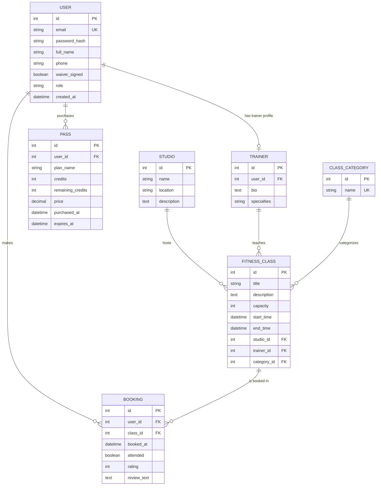

# FitPass - Backend

`Monolithic-App` layout: one `main.py` with all
routes, `controllers/` for business logic, `models/` for tables, `schemas/`
for serialization. 

## Structure

```
backend/
├── main.py                 # app setup + every route
├── extensions.py           # db, jwt, cors, migrate, ma
├── controllers/
│   ├── user_controller.py
│   ├── studio_controller.py
│   ├── trainer_controller.py
│   ├── class_controller.py
│   ├── pass_controller.py
│   └── booking_controller.py
├── models/
│   ├── user.py              # profile fields (full_name, phone, waiver) folded in
│   ├── studio.py
│   ├── trainer.py
│   ├── class_category.py
│   ├── fitness_class.py
│   ├── pass_model.py        # merges old MembershipPass catalog + PurchasedPass
│   └── booking.py
├── schemas/                 # one file per model, mirrors models/
├── migrations/              # generated with `flask db migrate`
├── seed.py
└── requirements.txt
```

## Entity Relationship Diagram




## Setup

```bash
python3 -m venv venv
source venv/bin/activate        # Windows: venv\Scripts\activate
pip install -r requirements.txt

cp .env.example .env            # then edit SECRET_KEY / JWT_SECRET_KEY

export FLASK_APP=main.py
flask db upgrade                # migrations

python seed.py                  # optional sample data
python main.py                  # http://127.0.0.1:5000
```

## Sample accounts (after `seed.py`)

| Email | Password | Role |
|---|---|---|
| admin@fitpass.com | AdminPass123! | admin |
| maya@fitpass.com | TrainerPass123! | trainer |
| sarah@example.com | ClientPass123! | client (has an active pass) |
| david@example.com | ClientPass123! | client (waiver not signed, no pass) |

## Endpoint map

| Method & URL | Auth | Notes |
|---|---|---|
| POST /auth/register | – | |
| POST /auth/login | – | |
| GET /auth/me | 🔒 | |
| GET /studios | – | `?location=` |
| GET /studios/<id> | – | |
| GET /studios/<id>/schedule | – | upcoming classes |
| GET /trainers | – | |
| GET /classes | – | `?studio_id=&category_id=&trainer_id=&q=` |
| GET /classes/categories | – | |
| GET /classes/<id> | – | |
| POST /classes | 🔒 admin | |
| GET /passes/plans | – | hardcoded catalog |
| GET /passes/my-passes | 🔒 | |
| POST /passes/purchase/<plan_key> | 🔒 | `drop-in` / `10-pack` / `monthly` |
| POST /bookings | 🔒 | spends a credit |
| GET /bookings | 🔒 | |
| DELETE /bookings/<id> | 🔒 | refunds credit if class hasn't started |
| POST /bookings/<id>/review | 🔒 | after class start time |